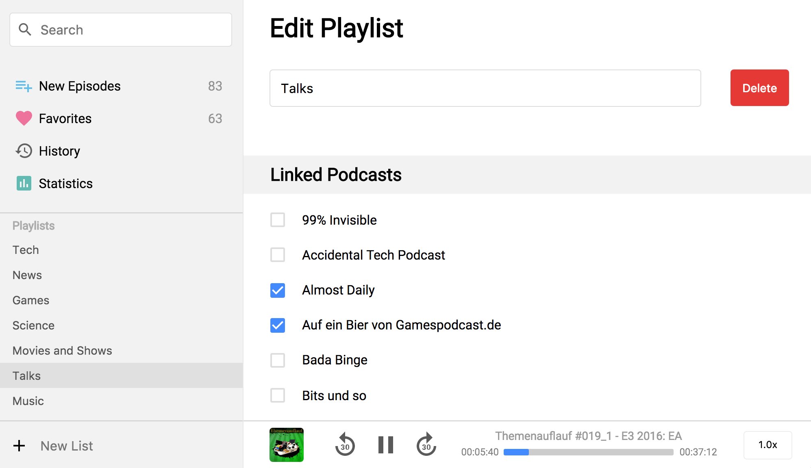

# Poddycast [BETA] :construction:

A Podcast app made with Electron because I love Podcasts.

## Feature

- Uses the **iTunes API** to search for Podcasts
- Find all episodes in the **New Episodes** menu item
- See all your **Favorite Podcasts** in one place
- Browse through the **History** of podcasts you've already listened to
- See some **Statistics**
- Manage **Playlists** for custom playback
- Dark mode
- Speedy playback
- Keyboard shortcuts for audio player actions
- Proxy mode for company environments

## Demo

### Rename Playlists

### Edit Playlist

<!--
### Subscribe to Podcasts

### Create a playlist

-->

## Install

Download the latest release from the [release page](https://github.com/MrChuckomo/poddycast/releases).

## Platform Support

- [x] macOS  
- [x] Windows
- [x] Linux

## Contact

:bird: [Twitter: @poddycastapp](https://twitter.com/poddycastapp)
