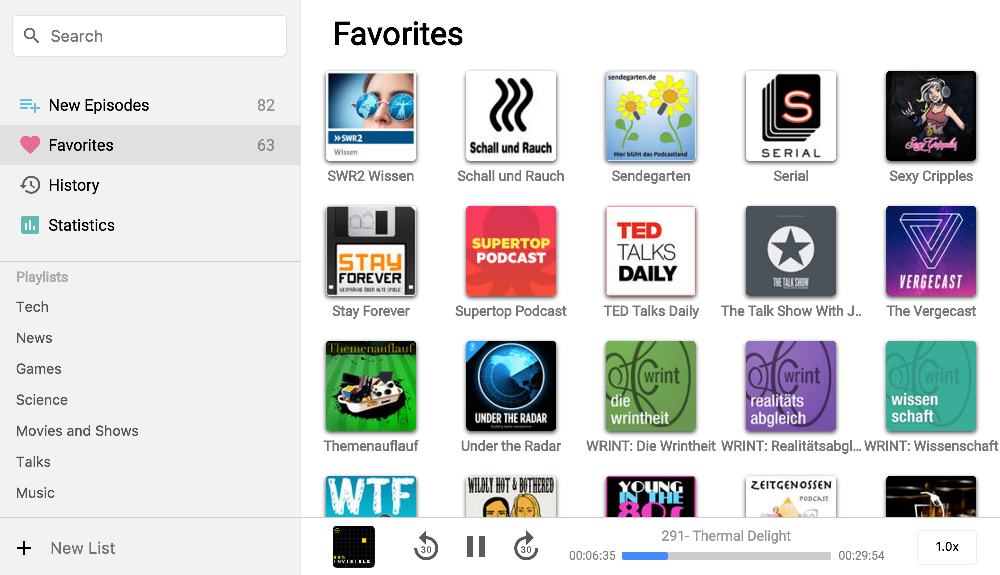

# Poddycast [BETA] :construction:

A Podcast app made with Electron because I love Podcasts.

Search for any Podcasts you like (using **iTunes**) and see if you already marked this Podcasts as favorite.
Find all episodes in the **New Episodes** menu item.
See all your **favorite Podcasts** in one place.
And search through the **history** of podcasts you listened to.

You can also create **playlists** to keep your Podcast collection nice and clean.

## Demo

<!--
### Subscribe to Podcasts

### Create a playlist

-->

## Install

Download this repository and it will work on macOS and Windows.  
[Beta Release v0.3.0](https://github.com/MrChuckomo/poddycast/releases)

## Platform Support

- [x] macOS  
- [x] Windows
- [ ] Linux (comming soon)

## Contact

:bird: [Twitter: @poddycastapp](https://twitter.com/poddycastapp)
