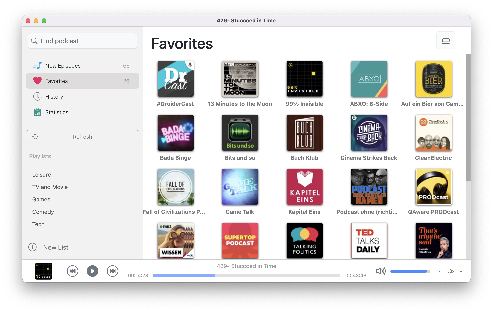
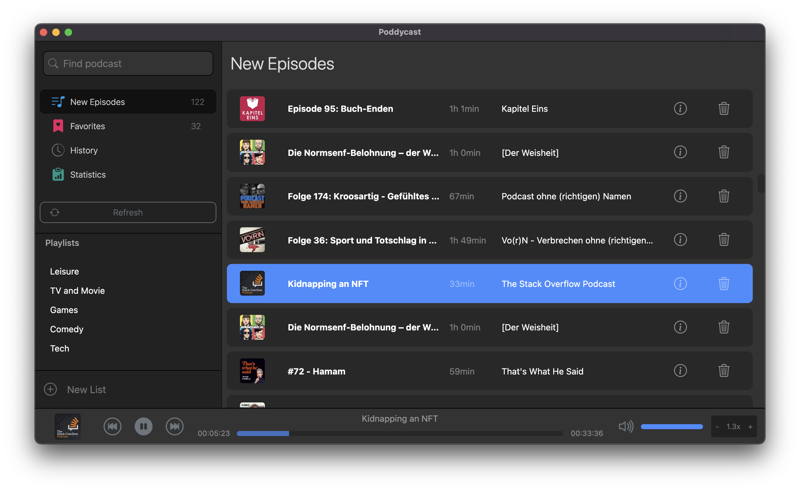
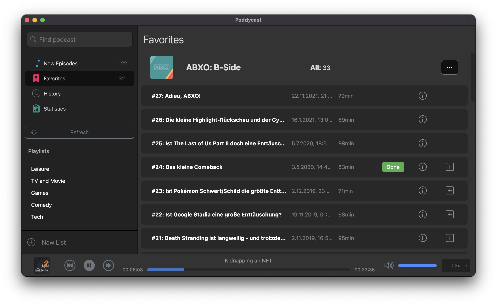
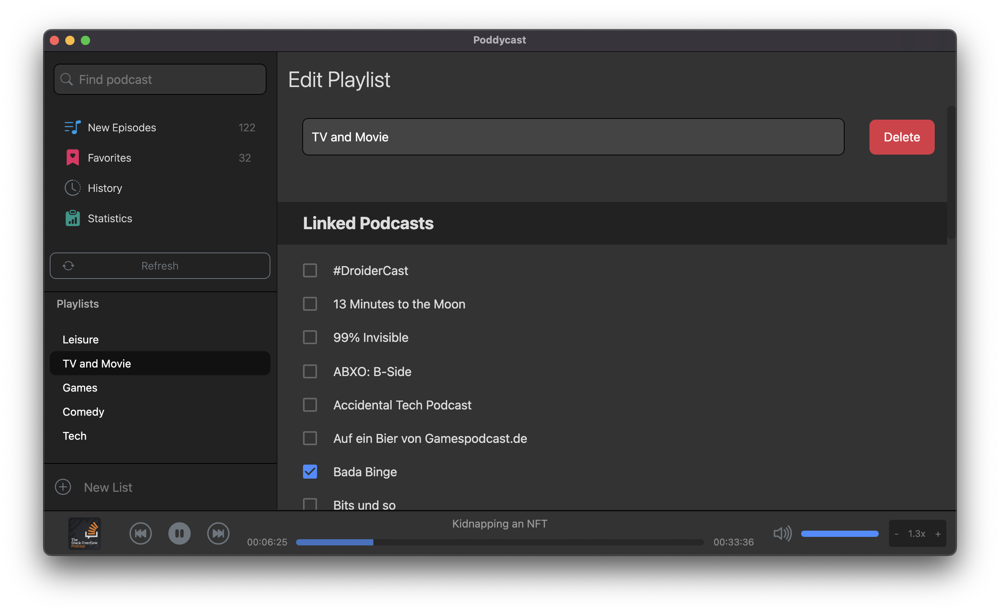

# Poddycast [pre-release] :construction:

A Podcast app made with Electron because I love Podcasts.

## Table of Contents
- [Table of Contents](#table-of-contents)
- [Install](#install)
- [Platform Support](#platform-support)
- [Features](#features)
  - [All New Episodes](#all-new-episodes)
  - [Browse Podcast Feeds](#browse-podcast-feeds)
  - [Edit Playlists](#edit-playlists)
- [Contact](#contact)

## Install

Download the latest release from the [release page](https://github.com/MrChuckomo/poddycast/releases).

## Platform Support

- [x] macOS  
- [x] Windows
- [x] Linux

## Features

- Uses the **iTunes API** to search for Podcasts
- Find all episodes in the **New Episodes** menu item
- See all your **Favorite Podcasts** in one place
- Browse through the **History** of podcasts you've already listened to
- See some **Statistics**
- Manage **Playlists** for custom playback
- OPML Import & Export
- Dark mode
- Speedy playback
- Keyboard shortcuts for audio player actions
- Proxy mode for company environments
- Internatialization

### All New Episodes

### Browse Podcast Feeds

### Edit Playlists

## Contact

I'm always happy to help, and discuss new features.
Please use any of these contact options to get in touch.   
You'll also find more useful stuff about the app, like tutorial and blogposts. 🍀

I'd be happy to hear from you guys 💕

- [Twitter: @poddycastapp](https://twitter.com/poddycastapp)
- [Patreon: @poddycastapp](https://patreon.com/poddycastapp)
- [Instagram: @poddycastapp](https://instagram.com/poddycastapp)
